# Bug Report - FR-02, FR-07, FR-16

| | |
|---|---|
| **Sinh viên** | Nguyễn Tấn Thắng - 23127259 |
| **SUT** | EShop: frontend-web `:5173`, frontend-admin `:5174`, backend API `:3000` |
| **Phát hiện bằng** | Playwright automation trên Chromium / Firefox / WebKit |
| **Ngày** | 2026-08-24 |
| **Kết quả** | 20 root defects, 21 `@bug` test case, 63 browser-level failures, 0 unexpected failure |

## Tổng quan

| ID | Feature | Mức độ | Tóm tắt | Test | Issue |
|---|---|---|---|---|---|
| BUG-01 | FR-02 | High | Email login không dùng type=email và label sai, làm mất HTML5 validation | TC05, TC12 | [#16](https://github.com/hungtmh/HW04-TESTING/issues/16) |
| BUG-02 | FR-02 | Critical | Một lần đăng nhập sai làm bộ đếm tăng 2 thay vì 1 | TC07 | [#17](https://github.com/hungtmh/HW04-TESTING/issues/17) |
| BUG-03 | FR-02 | Critical | Tài khoản bị khóa sớm trước lần đăng nhập sai thứ ba | TC08 | [#18](https://github.com/hungtmh/HW04-TESTING/issues/18) |
| BUG-04 | FR-02 | High | Thời gian khóa tài khoản là 180 giây thay vì 30 giây | TC09 | [#19](https://github.com/hungtmh/HW04-TESTING/issues/19) |
| BUG-05 | FR-21 | Medium | Trang Login không có H1 và hiển thị sai tiêu đề Đăng Ký | TC11 | [#20](https://github.com/hungtmh/HW04-TESTING/issues/20) |
| BUG-06 | FR-22 | Critical | Ô mật khẩu Login dùng type=text và làm lộ ký tự | TC13 | [#21](https://github.com/hungtmh/HW04-TESTING/issues/21) |
| BUG-07 | FR-21 | Low | Nút đăng nhập dùng tiếng Anh Sign In thay vì tiếng Việt | TC14 | [#22](https://github.com/hungtmh/HW04-TESTING/issues/22) |
| BUG-08 | FR-22 | Medium | Thông báo lỗi Login nằm dưới nút submit | TC15 | [#23](https://github.com/hungtmh/HW04-TESTING/issues/23) |
| BUG-09 | SEC-01 | Critical | API Login trả lại mật khẩu plaintext trong response | TC16 | [#24](https://github.com/hungtmh/HW04-TESTING/issues/24) |
| BUG-10 | FR-07 | High | Thêm cùng sản phẩm hai lần tạo hai dòng thay vì tăng số lượng | TC12 | [#25](https://github.com/hungtmh/HW04-TESTING/issues/25) |
| BUG-11 | FR-07 | High | Xóa sản phẩm khỏi giỏ không có dialog xác nhận | TC13 | [#26](https://github.com/hungtmh/HW04-TESTING/issues/26) |
| BUG-12 | FR-07 | Low | Nhãn tổng tiền hiển thị Tổng tạm tính thay vì Tổng cộng | TC14 | [#27](https://github.com/hungtmh/HW04-TESTING/issues/27) |
| BUG-13 | FR-07 | High | Giỏ hàng thiếu nút tăng giảm số lượng +/- | TC15 | [#28](https://github.com/hungtmh/HW04-TESTING/issues/28) |
| BUG-14 | FR-24 | Low | Empty state của giỏ hàng không có icon hoặc hình minh họa | TC16 | [#29](https://github.com/hungtmh/HW04-TESTING/issues/29) |
| BUG-15 | FR-07 | Low | Link tiếp tục mua sắm ở giỏ có nhãn sai | TC17 | [#30](https://github.com/hungtmh/HW04-TESTING/issues/30) |
| BUG-16 | FR-16 | Critical | User thường có thể gọi API admin import sản phẩm | TC06 | [#31](https://github.com/hungtmh/HW04-TESTING/issues/31) |
| BUG-17 | FR-16 | Critical | Import CSV không rollback toàn bộ khi một dòng lỗi | TC09 | [#32](https://github.com/hungtmh/HW04-TESTING/issues/32) |
| BUG-18 | FR-16 | Critical | Import chấp nhận sản phẩm có giá âm | TC10 | [#33](https://github.com/hungtmh/HW04-TESTING/issues/33) |
| BUG-19 | FR-16 | High | CSV parser không hỗ trợ dấu phẩy trong trường được quote theo RFC 4180 | TC11 | [#34](https://github.com/hungtmh/HW04-TESTING/issues/34) |
| BUG-20 | FR-16 | Low | File picker Import không giới hạn đuôi .csv | TC12 | [#35](https://github.com/hungtmh/HW04-TESTING/issues/35) |

> 21 test case `@bug` ánh xạ tới 20 root defects vì TC05 và TC12 của FR-02 cùng bắt nguồn từ email input sai `type`/label nhưng kiểm tra hai acceptance criteria khác nhau.

---

## BUG-01 - Email login không dùng type=email và label sai, làm mất HTML5 validation

- **Mức độ:** High
- **Feature / SRS:** FR-02 / FR-02, FR-22
- **Automation test:** TC05, TC12
- **GitHub Issue:** [#16](https://github.com/hungtmh/HW04-TESTING/issues/16)
- **Evidence:** `../evidence/bugs/BUG-01-email-login-khong-dung-type-email-va-label-sai-l.png`

### Mô tả

Automation đọc kỳ vọng từ FR-02, FR-22 và so sánh với hành vi thực tế. Case TC05, TC12 fail nhất quán trên cả ba browser engine; summary JSON ghi nhận không có failure nào ngoài nhóm `@bug`.

### Steps to reproduce

1. Mở /login
2. Nhập invalid-email và một mật khẩu bất kỳ
3. Quan sát form vẫn cho submit và kiểm tra thuộc tính DOM

### Expected

Ô email có type=email, label Email và trình duyệt từ chối chuỗi invalid-email.

### Actual

Ô email có type=text, label Username; invalid-email vẫn vượt qua checkValidity().

### Bằng chứng

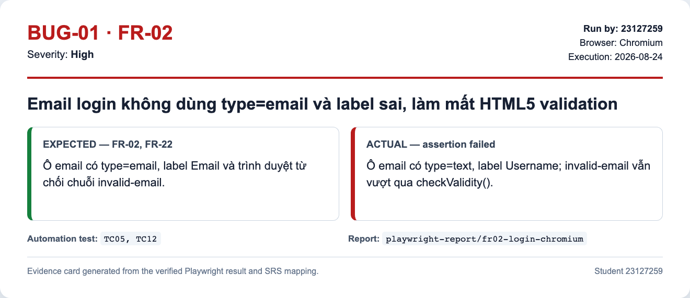

Ảnh trên là screenshot trực tiếp trang chi tiết Playwright HTML report Chromium: có test title, annotation sinh viên, assertion error, test steps và screenshot SUT nếu case có giao diện. Ảnh không được chèn thêm Expected/Actual; phần chú thích nằm ngoài ảnh. Firefox/WebKit cho cùng kết quả.

### Đề xuất sửa

Đổi input sang type=email, dùng label Email liên kết bằng htmlFor/id và giữ required.

---

## BUG-02 - Một lần đăng nhập sai làm bộ đếm tăng 2 thay vì 1

- **Mức độ:** Critical
- **Feature / SRS:** FR-02 / FR-02
- **Automation test:** TC07
- **GitHub Issue:** [#17](https://github.com/hungtmh/HW04-TESTING/issues/17)
- **Evidence:** `../evidence/bugs/BUG-02-mot-lan-ang-nhap-sai-lam-bo-em-tang-2-thay-vi-1.png`

### Mô tả

Automation đọc kỳ vọng từ FR-02 và so sánh với hành vi thực tế. Case TC07 fail nhất quán trên cả ba browser engine; summary JSON ghi nhận không có failure nào ngoài nhóm `@bug`.

### Steps to reproduce

1. Tạo tài khoản mới
2. Gọi POST /api/login một lần với mật khẩu sai
3. Đọc login_attempts qua API admin

### Expected

login_attempts tăng từ 0 lên đúng 1.

### Actual

login_attempts tăng từ 0 lên 2 sau một request sai mật khẩu.

### Bằng chứng

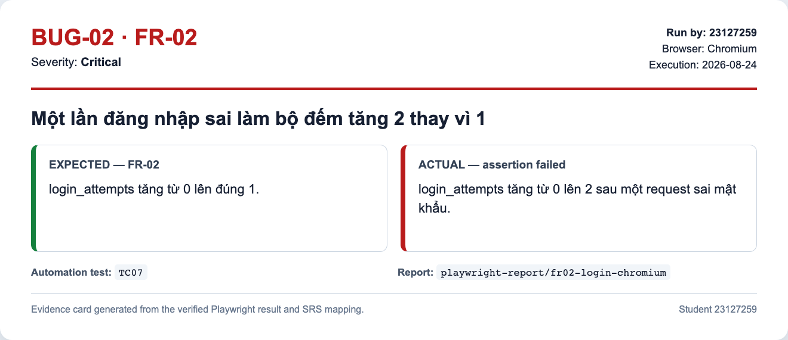

Ảnh trên là screenshot trực tiếp trang chi tiết Playwright HTML report Chromium: có test title, annotation sinh viên, assertion error, test steps và screenshot SUT nếu case có giao diện. Ảnh không được chèn thêm Expected/Actual; phần chú thích nằm ngoài ảnh. Firefox/WebKit cho cùng kết quả.

### Đề xuất sửa

Thay user.login_attempts + 2 bằng + 1 và bổ sung unit/integration test cho bộ đếm.

---

## BUG-03 - Tài khoản bị khóa sớm trước lần đăng nhập sai thứ ba

- **Mức độ:** Critical
- **Feature / SRS:** FR-02 / FR-02
- **Automation test:** TC08
- **GitHub Issue:** [#18](https://github.com/hungtmh/HW04-TESTING/issues/18)
- **Evidence:** `../evidence/bugs/BUG-03-tai-khoan-bi-khoa-som-truoc-lan-ang-nhap-sai-thu.png`

### Mô tả

Automation đọc kỳ vọng từ FR-02 và so sánh với hành vi thực tế. Case TC08 fail nhất quán trên cả ba browser engine; summary JSON ghi nhận không có failure nào ngoài nhóm `@bug`.

### Steps to reproduce

1. Tạo tài khoản mới
2. Gửi liên tiếp ba request login sai
3. Ghi lại status của từng response

### Expected

Ba request sai đầu tiên trả 401; trạng thái khóa áp dụng sau lần sai thứ ba.

### Actual

Chuỗi status là 401, 401, 403 vì tài khoản đã khóa sau hai lần sai.

### Bằng chứng

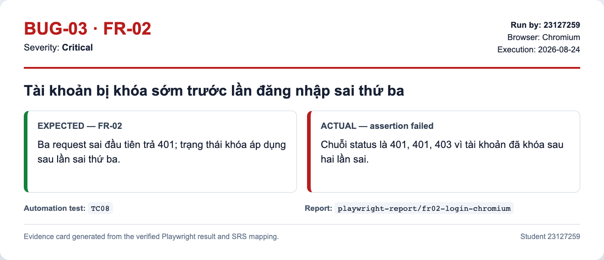

Ảnh trên là screenshot trực tiếp trang chi tiết Playwright HTML report Chromium: có test title, annotation sinh viên, assertion error, test steps và screenshot SUT nếu case có giao diện. Ảnh không được chèn thêm Expected/Actual; phần chú thích nằm ngoài ảnh. Firefox/WebKit cho cùng kết quả.

### Đề xuất sửa

Tăng counter đúng một đơn vị và chỉ thiết lập locked_until khi counter mới đạt ngưỡng 3.

---

## BUG-04 - Thời gian khóa tài khoản là 180 giây thay vì 30 giây

- **Mức độ:** High
- **Feature / SRS:** FR-02 / FR-02
- **Automation test:** TC09
- **GitHub Issue:** [#19](https://github.com/hungtmh/HW04-TESTING/issues/19)
- **Evidence:** `../evidence/bugs/BUG-04-thoi-gian-khoa-tai-khoan-la-180-giay-thay-vi-30-.png`

### Mô tả

Automation đọc kỳ vọng từ FR-02 và so sánh với hành vi thực tế. Case TC09 fail nhất quán trên cả ba browser engine; summary JSON ghi nhận không có failure nào ngoài nhóm `@bug`.

### Steps to reproduce

1. Kích hoạt trạng thái khóa
2. Đọc locked_until qua API admin
3. So sánh với thời gian hiện tại

### Expected

locked_until cách thời điểm khóa khoảng 30 giây.

### Actual

locked_until cách thời điểm khóa khoảng 180 giây.

### Bằng chứng

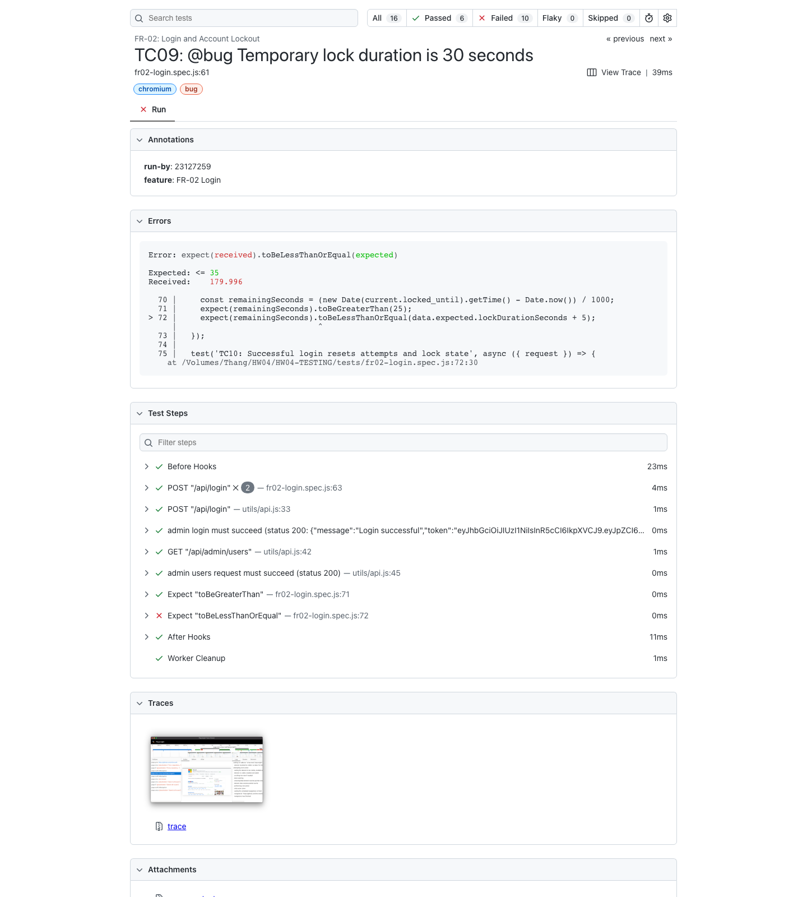

Ảnh trên là screenshot trực tiếp trang chi tiết Playwright HTML report Chromium: có test title, annotation sinh viên, assertion error, test steps và screenshot SUT nếu case có giao diện. Ảnh không được chèn thêm Expected/Actual; phần chú thích nằm ngoài ảnh. Firefox/WebKit cho cùng kết quả.

### Đề xuất sửa

Đổi 180000 ms thành 30000 ms và đưa thời lượng vào hằng số cấu hình.

---

## BUG-05 - Trang Login không có H1 và hiển thị sai tiêu đề Đăng Ký

- **Mức độ:** Medium
- **Feature / SRS:** FR-21 / FR-21
- **Automation test:** TC11
- **GitHub Issue:** [#20](https://github.com/hungtmh/HW04-TESTING/issues/20)
- **Evidence:** `../evidence/bugs/BUG-05-trang-login-khong-co-h1-va-hien-thi-sai-tieu-e-a.png`

### Mô tả

Automation đọc kỳ vọng từ FR-21 và so sánh với hành vi thực tế. Case TC11 fail nhất quán trên cả ba browser engine; summary JSON ghi nhận không có failure nào ngoài nhóm `@bug`.

### Steps to reproduce

1. Mở /login
2. Kiểm tra số phần tử h1
3. Đọc nội dung heading đang hiển thị

### Expected

Trang có đúng một H1 mô tả Đăng Nhập.

### Actual

Không có H1; heading H2 hiển thị Đăng Ký.

### Bằng chứng

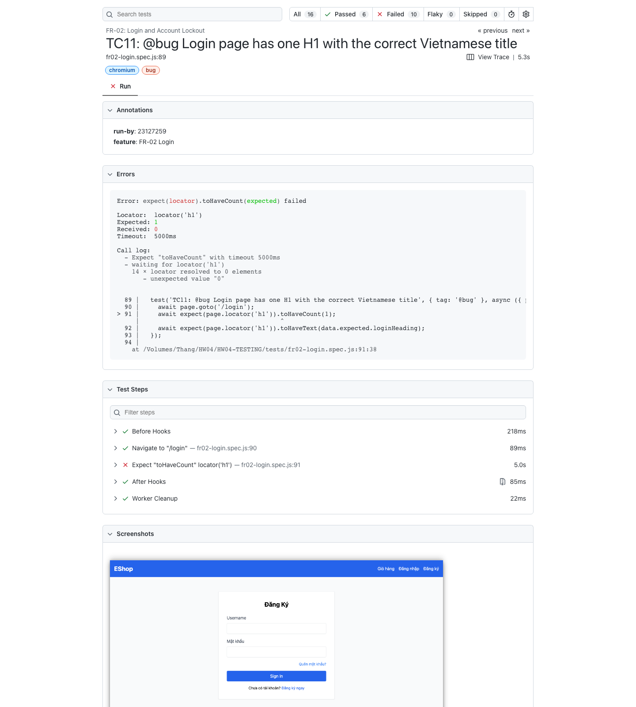

Ảnh trên là screenshot trực tiếp trang chi tiết Playwright HTML report Chromium: có test title, annotation sinh viên, assertion error, test steps và screenshot SUT nếu case có giao diện. Ảnh không được chèn thêm Expected/Actual; phần chú thích nằm ngoài ảnh. Firefox/WebKit cho cùng kết quả.

### Đề xuất sửa

Đổi heading thành một thẻ h1 với nội dung Đăng Nhập.

---

## BUG-06 - Ô mật khẩu Login dùng type=text và làm lộ ký tự

- **Mức độ:** Critical
- **Feature / SRS:** FR-22 / FR-22, SEC-01
- **Automation test:** TC13
- **GitHub Issue:** [#21](https://github.com/hungtmh/HW04-TESTING/issues/21)
- **Evidence:** `../evidence/bugs/BUG-06-o-mat-khau-login-dung-type-text-va-lam-lo-ky-tu.png`

### Mô tả

Automation đọc kỳ vọng từ FR-22, SEC-01 và so sánh với hành vi thực tế. Case TC13 fail nhất quán trên cả ba browser engine; summary JSON ghi nhận không có failure nào ngoài nhóm `@bug`.

### Steps to reproduce

1. Mở /login
2. Nhập mật khẩu
3. Kiểm tra thuộc tính type và phần hiển thị

### Expected

Ô mật khẩu dùng type=password và che giá trị nhập.

### Actual

Ô mật khẩu dùng type=text, ký tự hiển thị rõ.

### Bằng chứng

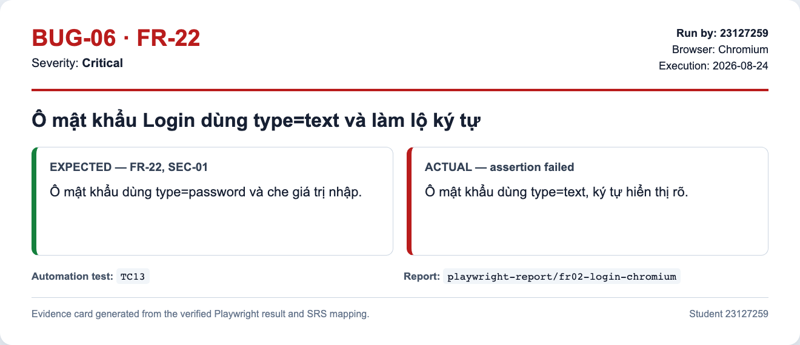

Ảnh trên là screenshot trực tiếp trang chi tiết Playwright HTML report Chromium: có test title, annotation sinh viên, assertion error, test steps và screenshot SUT nếu case có giao diện. Ảnh không được chèn thêm Expected/Actual; phần chú thích nằm ngoài ảnh. Firefox/WebKit cho cùng kết quả.

### Đề xuất sửa

Đổi input sang type=password và không log/echo giá trị mật khẩu.

---

## BUG-07 - Nút đăng nhập dùng tiếng Anh Sign In thay vì tiếng Việt

- **Mức độ:** Low
- **Feature / SRS:** FR-21 / FR-21
- **Automation test:** TC14
- **GitHub Issue:** [#22](https://github.com/hungtmh/HW04-TESTING/issues/22)
- **Evidence:** `../evidence/bugs/BUG-07-nut-ang-nhap-dung-tieng-anh-sign-in-thay-vi-tien.png`

### Mô tả

Automation đọc kỳ vọng từ FR-21 và so sánh với hành vi thực tế. Case TC14 fail nhất quán trên cả ba browser engine; summary JSON ghi nhận không có failure nào ngoài nhóm `@bug`.

### Steps to reproduce

1. Mở /login
2. Quan sát nút submit
3. So sánh nội dung với yêu cầu ngôn ngữ

### Expected

Nút submit có nhãn Đăng nhập.

### Actual

Nút submit có nhãn Sign In.

### Bằng chứng

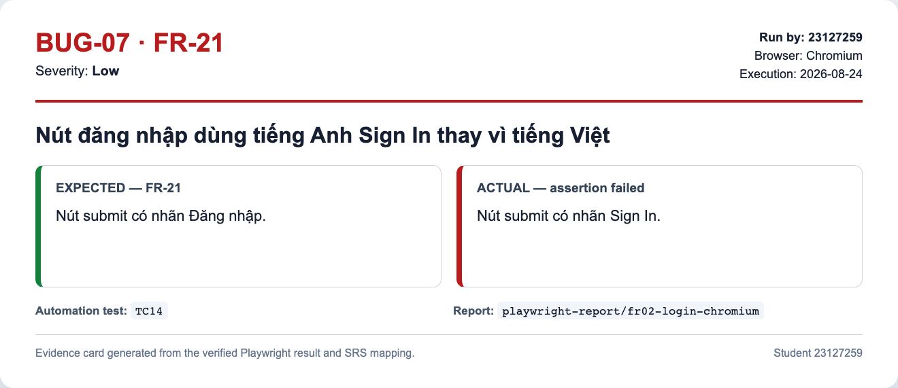

Ảnh trên là screenshot trực tiếp trang chi tiết Playwright HTML report Chromium: có test title, annotation sinh viên, assertion error, test steps và screenshot SUT nếu case có giao diện. Ảnh không được chèn thêm Expected/Actual; phần chú thích nằm ngoài ảnh. Firefox/WebKit cho cùng kết quả.

### Đề xuất sửa

Đổi nhãn nút thành Đăng nhập và rà soát tính nhất quán tiếng Việt.

---

## BUG-08 - Thông báo lỗi Login nằm dưới nút submit

- **Mức độ:** Medium
- **Feature / SRS:** FR-22 / FR-22
- **Automation test:** TC15
- **GitHub Issue:** [#23](https://github.com/hungtmh/HW04-TESTING/issues/23)
- **Evidence:** `../evidence/bugs/BUG-08-thong-bao-loi-login-nam-duoi-nut-submit.png`

### Mô tả

Automation đọc kỳ vọng từ FR-22 và so sánh với hành vi thực tế. Case TC15 fail nhất quán trên cả ba browser engine; summary JSON ghi nhận không có failure nào ngoài nhóm `@bug`.

### Steps to reproduce

1. Mở /login
2. Đăng nhập bằng mật khẩu sai
3. So sánh tọa độ banner lỗi và nút submit

### Expected

Banner lỗi xuất hiện phía trên nút submit.

### Actual

Banner lỗi được render sau form và nằm dưới nút submit.

### Bằng chứng

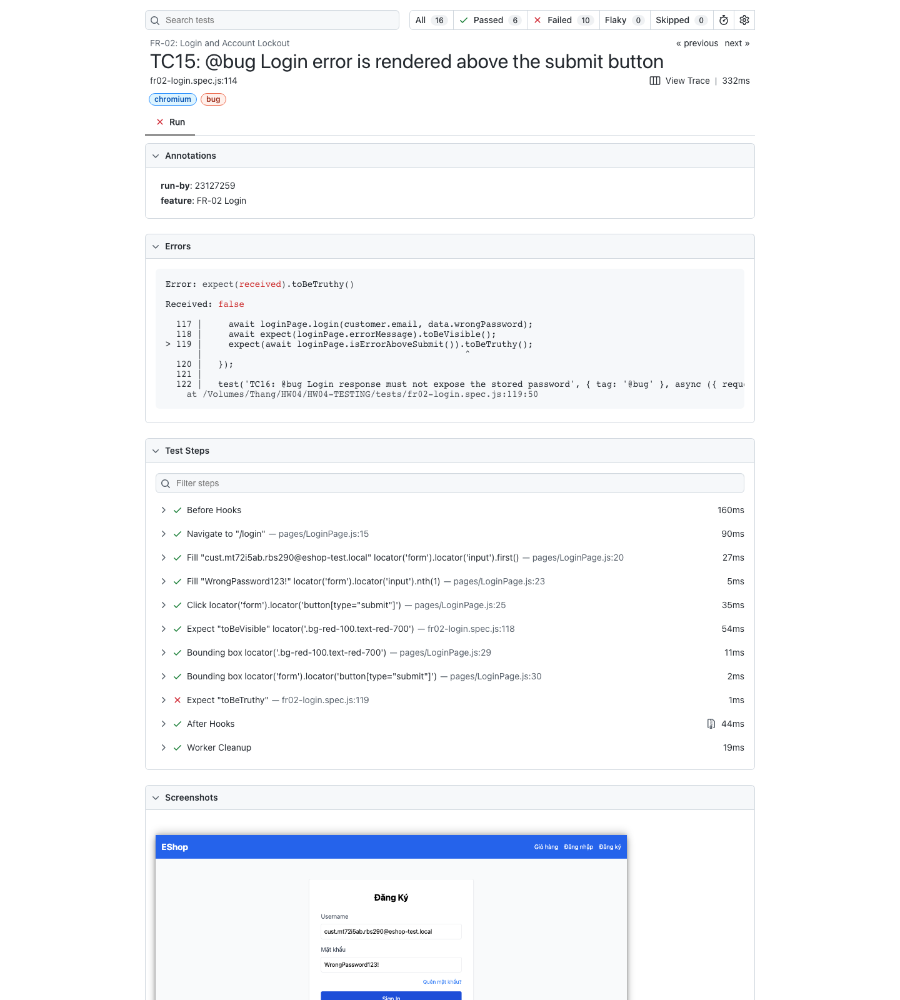

Ảnh trên là screenshot trực tiếp trang chi tiết Playwright HTML report Chromium: có test title, annotation sinh viên, assertion error, test steps và screenshot SUT nếu case có giao diện. Ảnh không được chèn thêm Expected/Actual; phần chú thích nằm ngoài ảnh. Firefox/WebKit cho cùng kết quả.

### Đề xuất sửa

Đưa error block vào trong form, trước nút submit và thêm aria-live.

---

## BUG-09 - API Login trả lại mật khẩu plaintext trong response

- **Mức độ:** Critical
- **Feature / SRS:** SEC-01 / SEC-01
- **Automation test:** TC16
- **GitHub Issue:** [#24](https://github.com/hungtmh/HW04-TESTING/issues/24)
- **Evidence:** `../evidence/bugs/BUG-09-api-login-tra-lai-mat-khau-plaintext-trong-respo.png`

### Mô tả

Automation đọc kỳ vọng từ SEC-01 và so sánh với hành vi thực tế. Case TC16 fail nhất quán trên cả ba browser engine; summary JSON ghi nhận không có failure nào ngoài nhóm `@bug`.

### Steps to reproduce

1. Đăng ký tài khoản mới
2. Gọi POST /api/login bằng thông tin hợp lệ
3. Kiểm tra object user trong JSON response

### Expected

Response login không có thuộc tính password; mật khẩu được hash khi lưu.

### Actual

response.user.password chứa nguyên văn mật khẩu Password 123.

### Bằng chứng

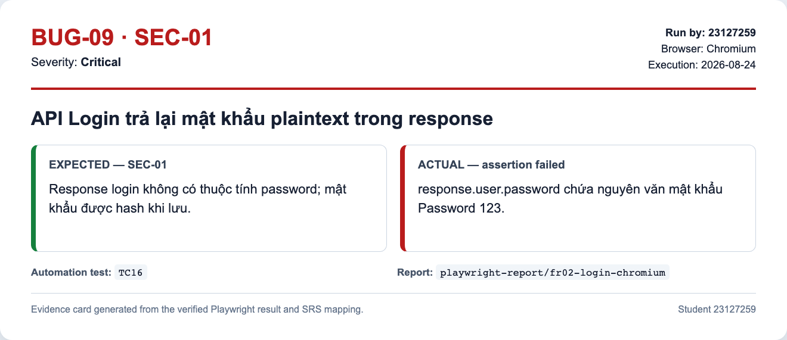

Ảnh trên là screenshot trực tiếp trang chi tiết Playwright HTML report Chromium: có test title, annotation sinh viên, assertion error, test steps và screenshot SUT nếu case có giao diện. Ảnh không được chèn thêm Expected/Actual; phần chú thích nằm ngoài ảnh. Firefox/WebKit cho cùng kết quả.

### Đề xuất sửa

Hash mật khẩu bằng bcrypt/argon2 và dùng SELECT/DTO không bao gồm password.

---

## BUG-10 - Thêm cùng sản phẩm hai lần tạo hai dòng thay vì tăng số lượng

- **Mức độ:** High
- **Feature / SRS:** FR-07 / FR-07
- **Automation test:** TC12
- **GitHub Issue:** [#25](https://github.com/hungtmh/HW04-TESTING/issues/25)
- **Evidence:** `../evidence/bugs/BUG-10-them-cung-san-pham-hai-lan-tao-hai-dong-thay-vi-.png`

### Mô tả

Automation đọc kỳ vọng từ FR-07 và so sánh với hành vi thực tế. Case TC12 fail nhất quán trên cả ba browser engine; summary JSON ghi nhận không có failure nào ngoài nhóm `@bug`.

### Steps to reproduce

1. Mở trang chủ
2. Bấm Thêm vào giỏ hai lần trên cùng sản phẩm
3. Mở giỏ hàng bằng link header

### Expected

Giỏ có một dòng với quantity=2.

### Actual

Giỏ có hai dòng độc lập, mỗi dòng quantity=1.

### Bằng chứng

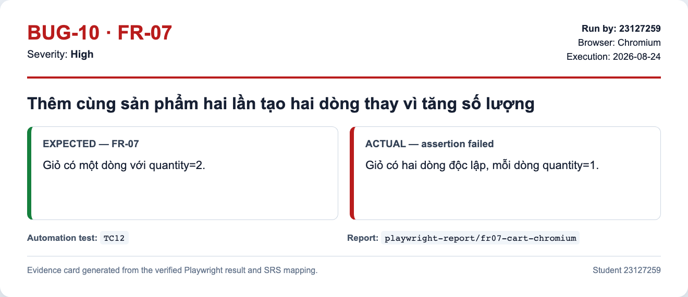

Ảnh trên là screenshot trực tiếp trang chi tiết Playwright HTML report Chromium: có test title, annotation sinh viên, assertion error, test steps và screenshot SUT nếu case có giao diện. Ảnh không được chèn thêm Expected/Actual; phần chú thích nằm ngoài ảnh. Firefox/WebKit cho cùng kết quả.

### Đề xuất sửa

Trong addToCart, tìm item theo product id và cộng quantity thay vì luôn append.

---

## BUG-11 - Xóa sản phẩm khỏi giỏ không có dialog xác nhận

- **Mức độ:** High
- **Feature / SRS:** FR-07 / FR-07, FR-24
- **Automation test:** TC13
- **GitHub Issue:** [#26](https://github.com/hungtmh/HW04-TESTING/issues/26)
- **Evidence:** `../evidence/bugs/BUG-11-xoa-san-pham-khoi-gio-khong-co-dialog-xac-nhan.png`

### Mô tả

Automation đọc kỳ vọng từ FR-07, FR-24 và so sánh với hành vi thực tế. Case TC13 fail nhất quán trên cả ba browser engine; summary JSON ghi nhận không có failure nào ngoài nhóm `@bug`.

### Steps to reproduce

1. Thêm một sản phẩm
2. Mở giỏ hàng
3. Bấm Xóa và theo dõi sự kiện dialog

### Expected

Phát sinh confirm dialog; dismiss giữ nguyên item.

### Actual

Không có dialog và item bị xóa ngay lập tức.

### Bằng chứng

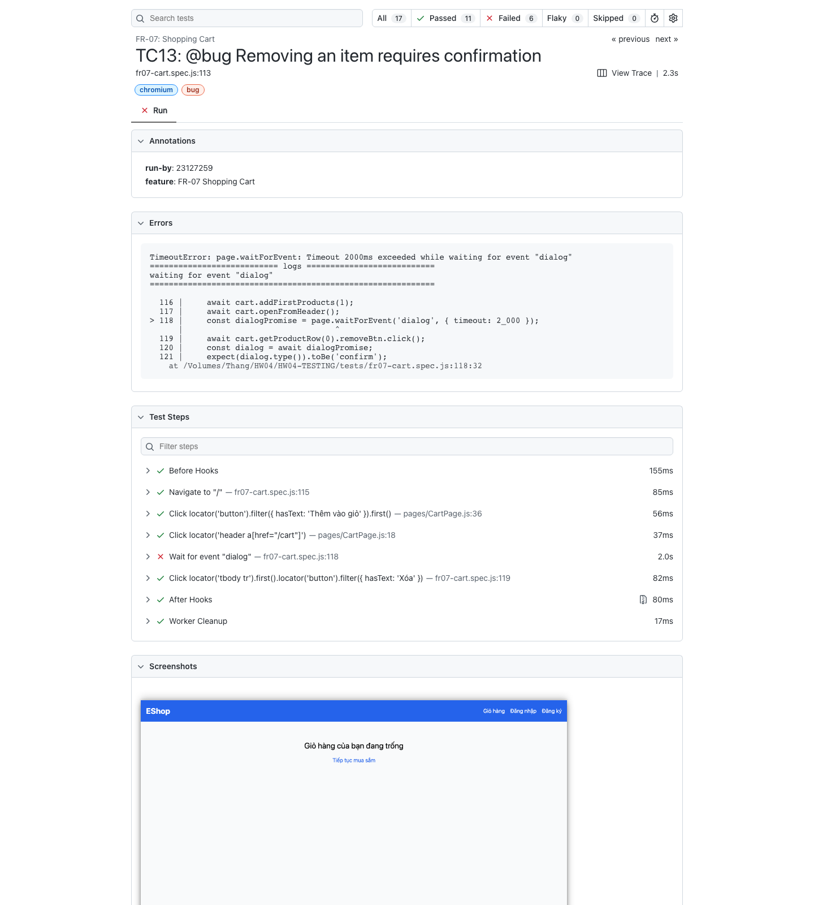

Ảnh trên là screenshot trực tiếp trang chi tiết Playwright HTML report Chromium: có test title, annotation sinh viên, assertion error, test steps và screenshot SUT nếu case có giao diện. Ảnh không được chèn thêm Expected/Actual; phần chú thích nằm ngoài ảnh. Firefox/WebKit cho cùng kết quả.

### Đề xuất sửa

Hiển thị dialog xác nhận trước khi gọi removeFromCart; chỉ xóa khi người dùng đồng ý.

---

## BUG-12 - Nhãn tổng tiền hiển thị Tổng tạm tính thay vì Tổng cộng

- **Mức độ:** Low
- **Feature / SRS:** FR-07 / FR-07
- **Automation test:** TC14
- **GitHub Issue:** [#27](https://github.com/hungtmh/HW04-TESTING/issues/27)
- **Evidence:** `../evidence/bugs/BUG-12-nhan-tong-tien-hien-thi-tong-tam-tinh-thay-vi-to.png`

### Mô tả

Automation đọc kỳ vọng từ FR-07 và so sánh với hành vi thực tế. Case TC14 fail nhất quán trên cả ba browser engine; summary JSON ghi nhận không có failure nào ngoài nhóm `@bug`.

### Steps to reproduce

1. Thêm một sản phẩm
2. Mở giỏ hàng
3. Đọc nhãn cạnh tổng tiền

### Expected

Nhãn chính xác là Tổng cộng.

### Actual

UI hiển thị Tổng tạm tính.

### Bằng chứng

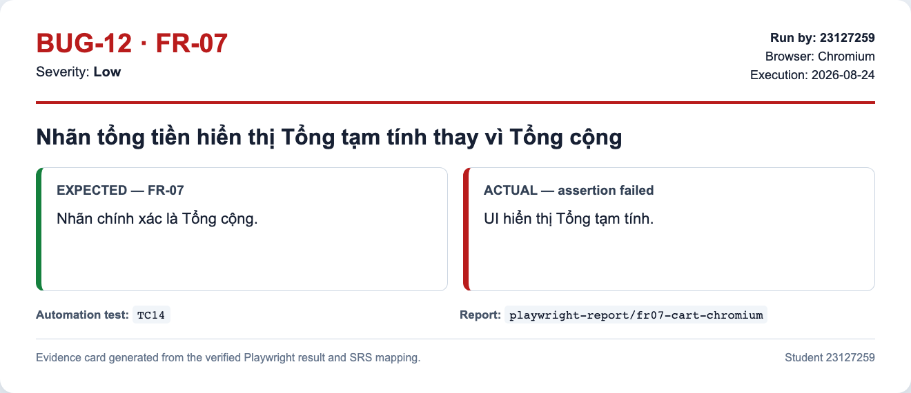

Ảnh trên là screenshot trực tiếp trang chi tiết Playwright HTML report Chromium: có test title, annotation sinh viên, assertion error, test steps và screenshot SUT nếu case có giao diện. Ảnh không được chèn thêm Expected/Actual; phần chú thích nằm ngoài ảnh. Firefox/WebKit cho cùng kết quả.

### Đề xuất sửa

Đổi copy UI thành Tổng cộng và thêm assertion component.

---

## BUG-13 - Giỏ hàng thiếu nút tăng giảm số lượng +/-

- **Mức độ:** High
- **Feature / SRS:** FR-07 / FR-07
- **Automation test:** TC15
- **GitHub Issue:** [#28](https://github.com/hungtmh/HW04-TESTING/issues/28)
- **Evidence:** `../evidence/bugs/BUG-13-gio-hang-thieu-nut-tang-giam-so-luong.png`

### Mô tả

Automation đọc kỳ vọng từ FR-07 và so sánh với hành vi thực tế. Case TC15 fail nhất quán trên cả ba browser engine; summary JSON ghi nhận không có failure nào ngoài nhóm `@bug`.

### Steps to reproduce

1. Thêm một sản phẩm
2. Mở giỏ hàng
3. Đếm button trong ô Số lượng

### Expected

Mỗi dòng có hai nút + và - để chỉnh quantity.

### Actual

Ô số lượng chỉ là text tĩnh, không có button.

### Bằng chứng

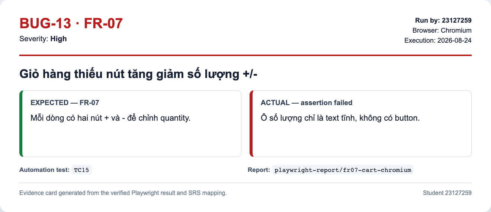

Ảnh trên là screenshot trực tiếp trang chi tiết Playwright HTML report Chromium: có test title, annotation sinh viên, assertion error, test steps và screenshot SUT nếu case có giao diện. Ảnh không được chèn thêm Expected/Actual; phần chú thích nằm ngoài ảnh. Firefox/WebKit cho cùng kết quả.

### Đề xuất sửa

Bổ sung increment/decrement handlers, giới hạn quantity tối thiểu 1 và cập nhật tổng tiền.

---

## BUG-14 - Empty state của giỏ hàng không có icon hoặc hình minh họa

- **Mức độ:** Low
- **Feature / SRS:** FR-24 / FR-07, FR-24
- **Automation test:** TC16
- **GitHub Issue:** [#29](https://github.com/hungtmh/HW04-TESTING/issues/29)
- **Evidence:** `../evidence/bugs/BUG-14-empty-state-cua-gio-hang-khong-co-icon-hoac-hinh.png`

### Mô tả

Automation đọc kỳ vọng từ FR-07, FR-24 và so sánh với hành vi thực tế. Case TC16 fail nhất quán trên cả ba browser engine; summary JSON ghi nhận không có failure nào ngoài nhóm `@bug`.

### Steps to reproduce

1. Mở /cart trong context mới
2. Xác nhận giỏ trống
3. Tìm img hoặc svg trong empty state

### Expected

Empty state có icon/hình minh họa và thông báo thân thiện.

### Actual

Chỉ có text và link, không có img hoặc svg.

### Bằng chứng

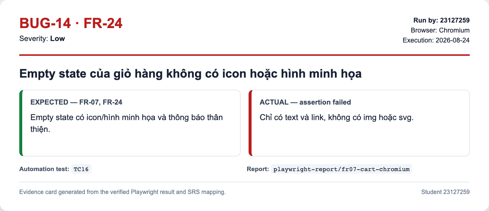

Ảnh trên là screenshot trực tiếp trang chi tiết Playwright HTML report Chromium: có test title, annotation sinh viên, assertion error, test steps và screenshot SUT nếu case có giao diện. Ảnh không được chèn thêm Expected/Actual; phần chú thích nằm ngoài ảnh. Firefox/WebKit cho cùng kết quả.

### Đề xuất sửa

Thêm illustration có alt text và giữ thông báo hiện tại.

---

## BUG-15 - Link tiếp tục mua sắm ở giỏ có nhãn sai

- **Mức độ:** Low
- **Feature / SRS:** FR-07 / FR-07
- **Automation test:** TC17
- **GitHub Issue:** [#30](https://github.com/hungtmh/HW04-TESTING/issues/30)
- **Evidence:** `../evidence/bugs/BUG-15-link-tiep-tuc-mua-sam-o-gio-co-nhan-sai.png`

### Mô tả

Automation đọc kỳ vọng từ FR-07 và so sánh với hành vi thực tế. Case TC17 fail nhất quán trên cả ba browser engine; summary JSON ghi nhận không có failure nào ngoài nhóm `@bug`.

### Steps to reproduce

1. Thêm một sản phẩm
2. Mở giỏ hàng
3. Đọc text của link quay về trang chủ

### Expected

Link có nhãn Tiếp tục mua sắm.

### Actual

Link hiển thị ← Mua tiếp.

### Bằng chứng

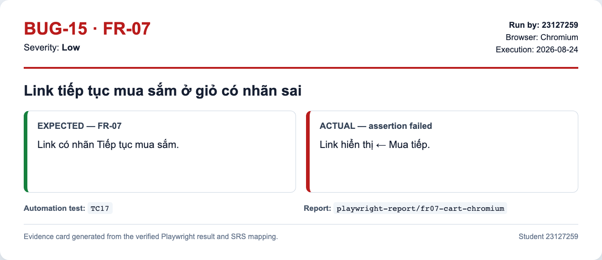

Ảnh trên là screenshot trực tiếp trang chi tiết Playwright HTML report Chromium: có test title, annotation sinh viên, assertion error, test steps và screenshot SUT nếu case có giao diện. Ảnh không được chèn thêm Expected/Actual; phần chú thích nằm ngoài ảnh. Firefox/WebKit cho cùng kết quả.

### Đề xuất sửa

Đổi nhãn thành Tiếp tục mua sắm.

---

## BUG-16 - User thường có thể gọi API admin import sản phẩm

- **Mức độ:** Critical
- **Feature / SRS:** FR-16 / FR-12, SEC-03
- **Automation test:** TC06
- **GitHub Issue:** [#31](https://github.com/hungtmh/HW04-TESTING/issues/31)
- **Evidence:** `../evidence/bugs/BUG-16-user-thuong-co-the-goi-api-admin-import-san-pham.png`

### Mô tả

Automation đọc kỳ vọng từ FR-12, SEC-03 và so sánh với hành vi thực tế. Case TC06 fail nhất quán trên cả ba browser engine; summary JSON ghi nhận không có failure nào ngoài nhóm `@bug`.

### Steps to reproduce

1. Tạo customer và lấy JWT
2. Gọi POST /api/admin/import-products bằng token customer
3. Kiểm tra status và dữ liệu được insert

### Expected

Token customer bị từ chối 403.

### Actual

Token customer import sản phẩm thành công với status 200.

### Bằng chứng

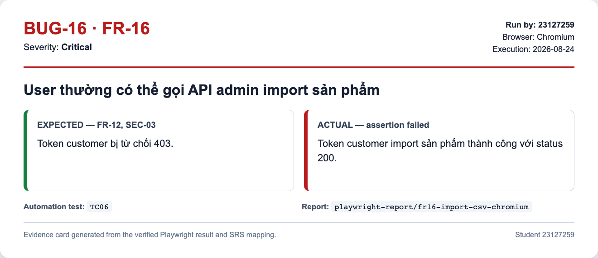

Ảnh trên là screenshot trực tiếp trang chi tiết Playwright HTML report Chromium: có test title, annotation sinh viên, assertion error, test steps và screenshot SUT nếu case có giao diện. Ảnh không được chèn thêm Expected/Actual; phần chú thích nằm ngoài ảnh. Firefox/WebKit cho cùng kết quả.

### Đề xuất sửa

Thêm middleware requireAdmin kiểm tra req.user.role === admin.

---

## BUG-17 - Import CSV không rollback toàn bộ khi một dòng lỗi

- **Mức độ:** Critical
- **Feature / SRS:** FR-16 / FR-16
- **Automation test:** TC09
- **GitHub Issue:** [#32](https://github.com/hungtmh/HW04-TESTING/issues/32)
- **Evidence:** `../evidence/bugs/BUG-17-import-csv-khong-rollback-toan-bo-khi-mot-dong-l.png`

### Mô tả

Automation đọc kỳ vọng từ FR-16 và so sánh với hành vi thực tế. Case TC09 fail nhất quán trên cả ba browser engine; summary JSON ghi nhận không có failure nào ngoài nhóm `@bug`.

### Steps to reproduce

1. Ghi nhận số sản phẩm
2. Import batch có một dòng hợp lệ và một dòng thiếu name
3. Đếm lại sản phẩm

### Expected

Số sản phẩm không đổi nếu bất kỳ dòng nào invalid.

### Actual

Dòng hợp lệ vẫn được insert, số sản phẩm tăng 1.

### Bằng chứng

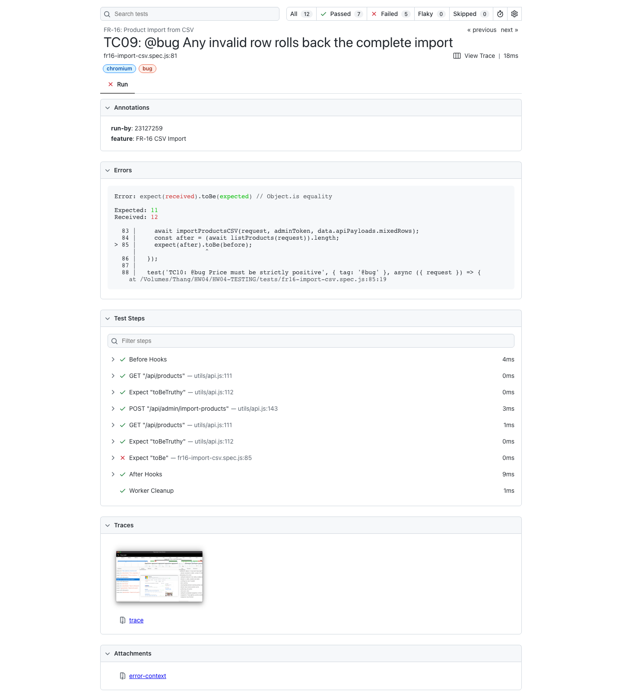

Ảnh trên là screenshot trực tiếp trang chi tiết Playwright HTML report Chromium: có test title, annotation sinh viên, assertion error, test steps và screenshot SUT nếu case có giao diện. Ảnh không được chèn thêm Expected/Actual; phần chú thích nằm ngoài ảnh. Firefox/WebKit cho cùng kết quả.

### Đề xuất sửa

Validate toàn bộ batch trước, sau đó insert trong transaction BEGIN/ROLLBACK/COMMIT.

---

## BUG-18 - Import chấp nhận sản phẩm có giá âm

- **Mức độ:** Critical
- **Feature / SRS:** FR-16 / FR-15, FR-16
- **Automation test:** TC10
- **GitHub Issue:** [#33](https://github.com/hungtmh/HW04-TESTING/issues/33)
- **Evidence:** `../evidence/bugs/BUG-18-import-chap-nhan-san-pham-co-gia-am.png`

### Mô tả

Automation đọc kỳ vọng từ FR-15, FR-16 và so sánh với hành vi thực tế. Case TC10 fail nhất quán trên cả ba browser engine; summary JSON ghi nhận không có failure nào ngoài nhóm `@bug`.

### Steps to reproduce

1. Đăng nhập admin
2. Import payload có price=-500
3. Kiểm tra response và danh sách sản phẩm

### Expected

API trả 400 và error cho price <= 0.

### Actual

Sản phẩm giá -500 được insert với status 200.

### Bằng chứng

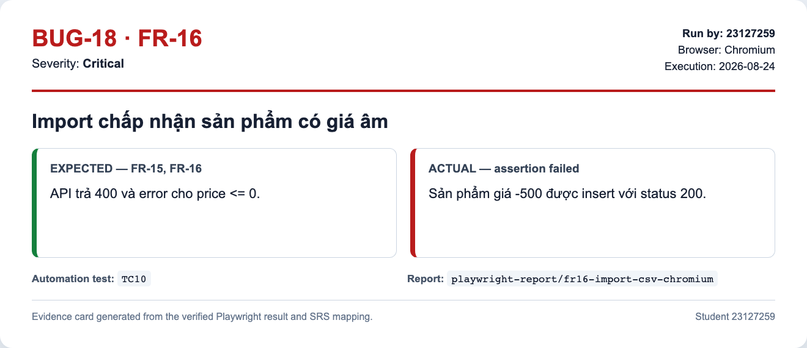

Ảnh trên là screenshot trực tiếp trang chi tiết Playwright HTML report Chromium: có test title, annotation sinh viên, assertion error, test steps và screenshot SUT nếu case có giao diện. Ảnh không được chèn thêm Expected/Actual; phần chú thích nằm ngoài ảnh. Firefox/WebKit cho cùng kết quả.

### Đề xuất sửa

Chuyển price sang number hữu hạn và từ chối khi <= 0 trước transaction.

---

## BUG-19 - CSV parser không hỗ trợ dấu phẩy trong trường được quote theo RFC 4180

- **Mức độ:** High
- **Feature / SRS:** FR-16 / FR-16
- **Automation test:** TC11
- **GitHub Issue:** [#34](https://github.com/hungtmh/HW04-TESTING/issues/34)
- **Evidence:** `../evidence/bugs/BUG-19-csv-parser-khong-ho-tro-dau-phay-trong-truong-uo.png`

### Mô tả

Automation đọc kỳ vọng từ FR-16 và so sánh với hành vi thực tế. Case TC11 fail nhất quán trên cả ba browser engine; summary JSON ghi nhận không có failure nào ngoài nhóm `@bug`.

### Steps to reproduce

1. Đăng nhập admin và mở tab Sản phẩm
2. Chọn fr16-rfc4180-quoted.csv
3. Kiểm tra preview row đầu

### Expected

Cell name giữ nguyên Product, with comma và price nằm ở cột tiếp theo.

### Actual

Frontend split(','); cell đầu thành "Product và các cột bị lệch.

### Bằng chứng

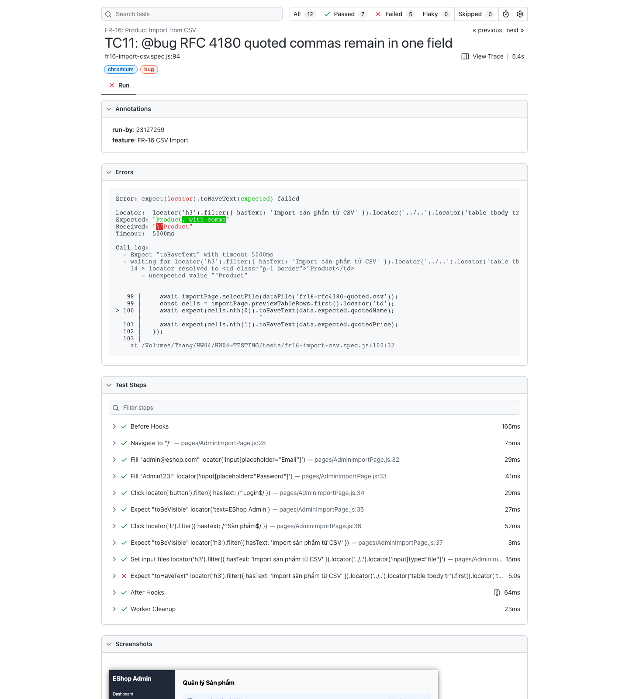

Ảnh trên là screenshot trực tiếp trang chi tiết Playwright HTML report Chromium: có test title, annotation sinh viên, assertion error, test steps và screenshot SUT nếu case có giao diện. Ảnh không được chèn thêm Expected/Actual; phần chú thích nằm ngoài ảnh. Firefox/WebKit cho cùng kết quả.

### Đề xuất sửa

Dùng csv-parse/Papa Parse hoặc parser RFC 4180 thay cho String.split.

---

## BUG-20 - File picker Import không giới hạn đuôi .csv

- **Mức độ:** Low
- **Feature / SRS:** FR-16 / FR-16
- **Automation test:** TC12
- **GitHub Issue:** [#35](https://github.com/hungtmh/HW04-TESTING/issues/35)
- **Evidence:** `../evidence/bugs/BUG-20-file-picker-import-khong-gioi-han-uoi-csv.png`

### Mô tả

Automation đọc kỳ vọng từ FR-16 và so sánh với hành vi thực tế. Case TC12 fail nhất quán trên cả ba browser engine; summary JSON ghi nhận không có failure nào ngoài nhóm `@bug`.

### Steps to reproduce

1. Đăng nhập admin
2. Mở tab Sản phẩm
3. Kiểm tra thuộc tính accept của input file

### Expected

Input file có accept=.csv và backend vẫn kiểm tra định dạng.

### Actual

Thuộc tính accept không tồn tại.

### Bằng chứng

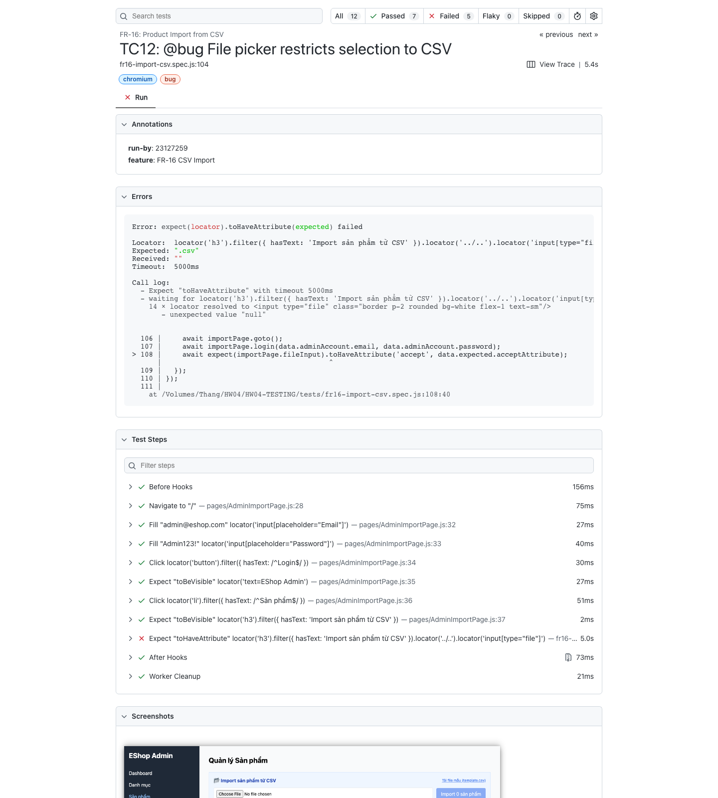

Ảnh trên là screenshot trực tiếp trang chi tiết Playwright HTML report Chromium: có test title, annotation sinh viên, assertion error, test steps và screenshot SUT nếu case có giao diện. Ảnh không được chèn thêm Expected/Actual; phần chú thích nằm ngoài ảnh. Firefox/WebKit cho cùng kết quả.

### Đề xuất sửa

Thêm accept=.csv ở frontend và validate MIME/extension ở backend.

---

## Trạng thái GitHub Issues

| Bug | Issue |
|---|---|
| BUG-01 | [#16](https://github.com/hungtmh/HW04-TESTING/issues/16) |
| BUG-02 | [#17](https://github.com/hungtmh/HW04-TESTING/issues/17) |
| BUG-03 | [#18](https://github.com/hungtmh/HW04-TESTING/issues/18) |
| BUG-04 | [#19](https://github.com/hungtmh/HW04-TESTING/issues/19) |
| BUG-05 | [#20](https://github.com/hungtmh/HW04-TESTING/issues/20) |
| BUG-06 | [#21](https://github.com/hungtmh/HW04-TESTING/issues/21) |
| BUG-07 | [#22](https://github.com/hungtmh/HW04-TESTING/issues/22) |
| BUG-08 | [#23](https://github.com/hungtmh/HW04-TESTING/issues/23) |
| BUG-09 | [#24](https://github.com/hungtmh/HW04-TESTING/issues/24) |
| BUG-10 | [#25](https://github.com/hungtmh/HW04-TESTING/issues/25) |
| BUG-11 | [#26](https://github.com/hungtmh/HW04-TESTING/issues/26) |
| BUG-12 | [#27](https://github.com/hungtmh/HW04-TESTING/issues/27) |
| BUG-13 | [#28](https://github.com/hungtmh/HW04-TESTING/issues/28) |
| BUG-14 | [#29](https://github.com/hungtmh/HW04-TESTING/issues/29) |
| BUG-15 | [#30](https://github.com/hungtmh/HW04-TESTING/issues/30) |
| BUG-16 | [#31](https://github.com/hungtmh/HW04-TESTING/issues/31) |
| BUG-17 | [#32](https://github.com/hungtmh/HW04-TESTING/issues/32) |
| BUG-18 | [#33](https://github.com/hungtmh/HW04-TESTING/issues/33) |
| BUG-19 | [#34](https://github.com/hungtmh/HW04-TESTING/issues/34) |
| BUG-20 | [#35](https://github.com/hungtmh/HW04-TESTING/issues/35) |

Tất cả Issue được tạo bằng tài khoản GitHub `thangak18` và gắn evidence từ nhánh bài làm.
